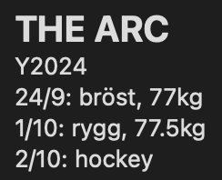

# **Training Tracker**

## **Overview**

#### Simple python script to see your training progress daily.

#### Shows graph of you progress

## How to use

### Step 1

#### Option 1 (APPLE USERS)

Create a note in your Apple Notes app with the headline "THE ARC"

This is where you will track your workouts

This way you can use write the notes on your iPhone and when you run the script on your MacBook, the note automatically syncs.

Requires Notes to be synched with iCloud

#### Option 2

Write directly to the .txt file in the repository

### Step 2

#### Write in your file (notes or other) using the following format:

- At the beginning of the file, put your title
- For the beginning of year put Y"THE YEAR", e.g. Y2024
- For every activity, put (D)D/(M)M: ACTIVITY, WEIGHT kg (if ACTIVITY is "löpning" or "run", put the distance you ran, eg. 9km (or miles))
- Adding WEIGHT is optional for workouts
- Adding distance for runs are mandatory
- If there is a new year, put Y"[NEW YEAR]", e.g. Y2025

## Example

Y2024  
29/12: run, 8km  
30/12: gym, 83.5kg  
31/12: golf  
Y2025  
1/1: gym, 82.5kg  
2/1: run, 5km

#### From my notes

## Specs

Run `pip install matplotlib mplcursors`  
If you are using Python 3, you might need to run `pip3 install matplotlib mplcursors` instead

**Run with:**

- `python tracker.py`
